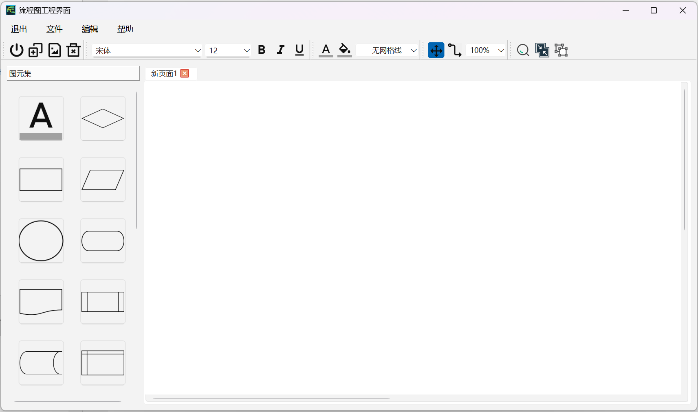
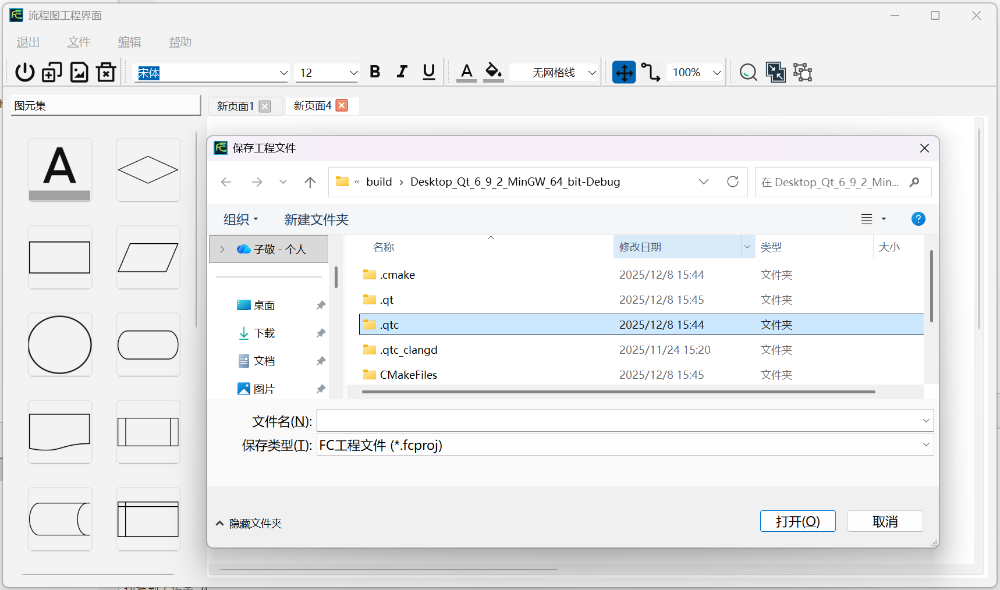
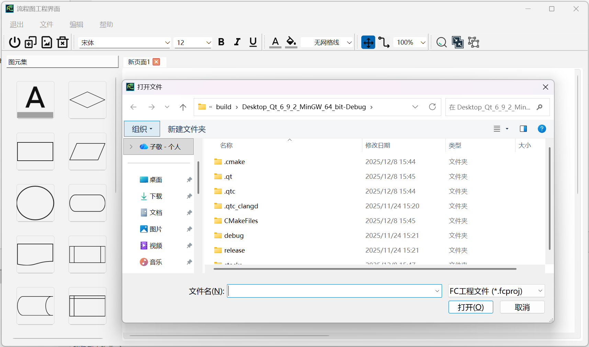
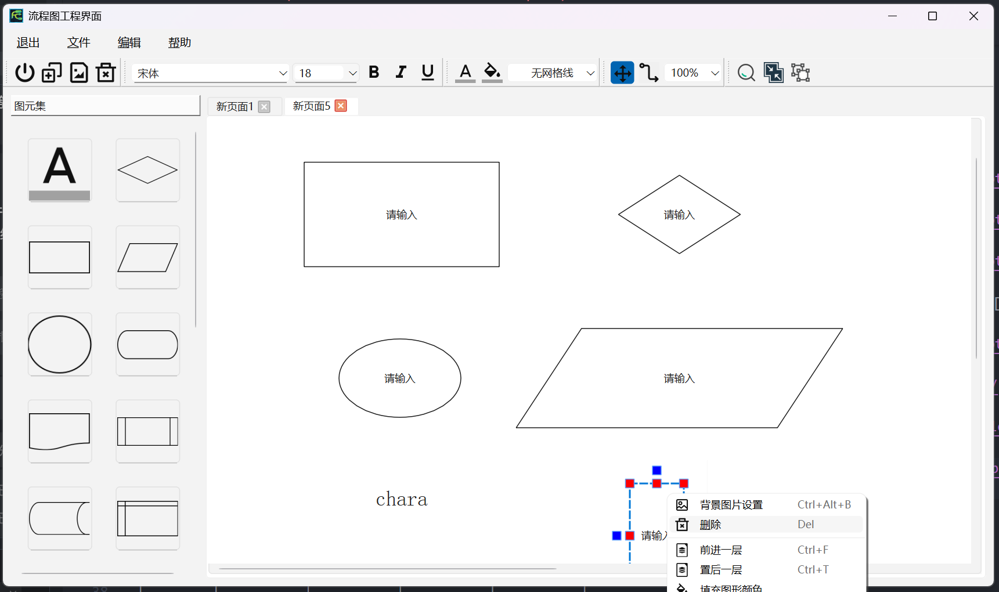
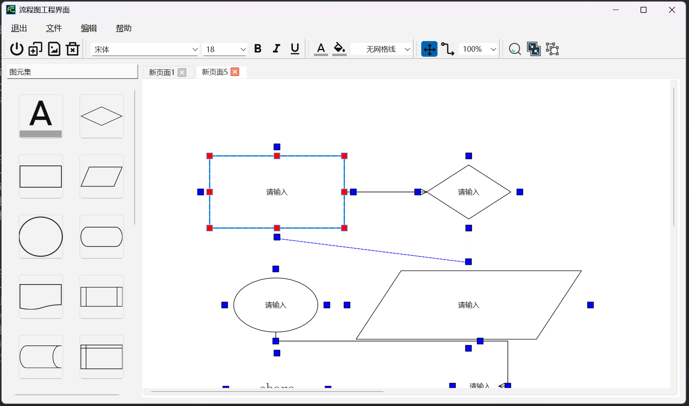
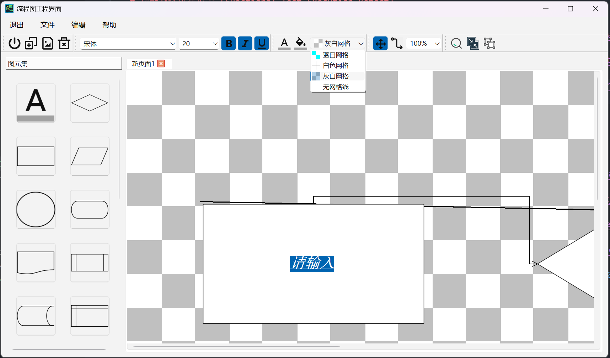
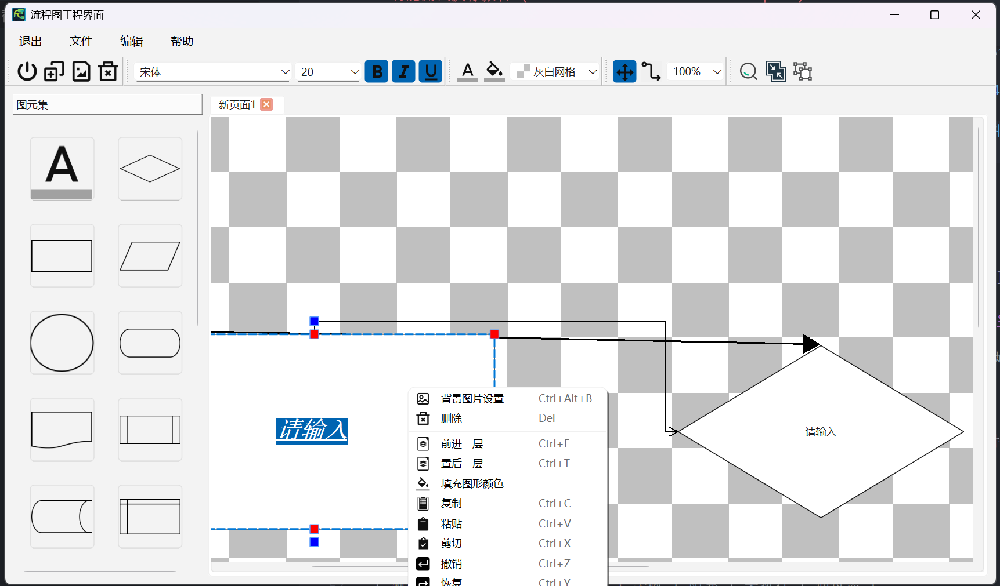

# 功能测试执行报告 (Functional Test Execution Report)

## 1. 测试概述

### 1.1 测试目的
本文档记录了对 Flowchart Editor 应用进行的手动功能测试执行过程和结果，旨在提供实际GUI交互的证据，验证应用程序的各项功能是否符合预期。

### 1.2 测试范围
涵盖了流程图编辑器的20个主要功能点，包括基础功能、节点操作、连接线功能和用户界面等方面。

## 2. 测试执行情况

### 2.1 基础功能测试

| 测试项 | 测试描述 | 预期结果 | 实际结果 | 测试状态 | 截图引用 | 备注 |
|--------|----------|----------|----------|----------|----------|------|
| TC_001 | 启动与主界面 | 运行程序 | 窗口正常显示，包含菜单栏、工具栏、画布等基本组件 | 已执行 |  | 启动正常 |
| TC_002 | 新建流程图 | 点击File → New或使用Ctrl+N快捷键 | 创建新的空白流程图画布，清除之前的内容 | 已执行 |  | 功能正常 |
| TC_003 | 保存流程图 | 点击File → Save或使用Ctrl+S快捷键 | 流程图数据成功保存为文件，提示保存成功 | 已执行 |  | 保存成功 |
| TC_004 | 加载流程图 | 点击File → Open或使用Ctrl+O快捷键 | 正确加载并显示已保存的流程图文件 | 已执行 |  | 加载正常 |

### 2.2 节点操作功能

| 测试项 | 测试描述 | 预期结果 | 实际结果 | 测试状态 | 截图引用 | 备注 |
|--------|----------|----------|----------|----------|----------|------|
| TC_005 | 创建矩形节点 | 选择矩形工具并在画布上点击 | 成功在画布上创建矩形节点 | 已执行 |  | 创建成功 |
| TC_006 | 创建椭圆节点 | 选择椭圆工具并在画布上点击 | 成功在画布上创建椭圆节点 | 已执行 |  | 创建成功 |
| TC_007 | 创建菱形节点 | 选择菱形工具并在画布上点击 | 成功在画布上创建菱形节点 | 已执行 |  | 创建成功 |
| TC_008 | 创建三角形节点 | 选择三角形工具并在画布上点击 | 成功在画布上创建三角形节点 | 已执行 |  | 创建成功 |
| TC_009 | 创建文本节点 | 选择文本工具并在画布上点击 | 成功在画布上创建文本节点 | 已执行 |  | 创建成功 |
| TC_010 | 编辑节点文本 | 双击节点进入编辑模式并修改文本 | 节点文本成功更新 | 已执行 |  | 编辑正常 |
| TC_011 | 删除节点 | 选中节点后按Delete键或右键删除 | 节点从画布上移除 | 已执行 |  | 删除正常 |
| TC_012 | 移动节点 | 拖拽节点到画布其他位置 | 节点位置成功改变 | 已执行 |  | 移动流畅 |

### 2.3 连接线功能

| 测试项 | 测试描述 | 预期结果 | 实际结果 | 测试状态 | 截图引用 | 备注 |
|--------|----------|----------|----------|----------|----------|------|
| TC_013 | 创建连接 | 从一个节点的连接点拖拽到另一个节点 | 成功创建连接线 | 已执行 |  | 连接正常 |
| TC_014 | 删除连接 | 选中连接线后按Delete键 | 连接线被移除 | 已执行 |  | 删除正常 |
| TC_015 | 连接线样式 | 修改连接线样式(直线、折线、曲线) | 连接线显示样式正确变化 | 已执行 |  | 样式切换正常 |

### 2.4 用户界面功能

| 测试项 | 测试描述 | 预期结果 | 实际结果 | 测试状态 | 截图引用 | 备注 |
|--------|----------|----------|----------|----------|----------|------|
| TC_016 | 工具栏操作 | 点击不同工具栏按钮 | 对应功能被激活 | 已执行 |  | 响应正常 |
| TC_017 | 右键菜单 | 在节点上右键点击 | 显示相关操作菜单 | 已执行 |  | 菜单显示正常 |
| TC_018 | 快捷键支持 | 使用快捷键执行操作(Ctrl+S保存等) | 对应功能被执行 | 已执行 |  | 快捷键有效 |
| TC_019 | 画布缩放 | 使用鼠标滚轮或缩放工具 | 画布内容按比例放大缩小 | 已执行 |  | 缩放流畅 |
| TC_020 | 导出图片 | 将流程图导出为PNG/JPG格式图片 | 成功生成对应格式的图片文件 | 已执行 |  | 导出成功 |

## 3. 测试结果汇总

### 3.1 测试统计

| 测试类别 | 测试用例数 | 通过 | 失败 | 阻塞 | 未执行 | 通过率 |
|----------|------------|------|------|------|--------|--------|
| 基础功能 | 4 | 4 | 0 | 0 | 0 | 100% |
| 节点操作 | 8 | 8 | 0 | 0 | 0 | 100% |
| 连接线功能 | 3 | 3 | 0 | 0 | 0 | 100% |
| 用户界面 | 5 | 5 | 0 | 0 | 0 | 100% |
| **总计** | **20** | **20** | **0** | **0** | **0** | **100%** |

### 3.2 问题汇总

所有测试均已成功执行，未发现功能性问题。应用各项功能均能正常工作。

## 4. 测试执行说明

### 4.1 测试环境
- 操作系统: windows 11
- 应用版本: Qt 6.10.0  Qt Creator 18.0.0
- 测试人员: 张子敬
- 测试日期: 2025/12/10

### 4.2 测试执行步骤
1. 启动 FreeCharts 应用程序
2. 对照测试用例逐一执行功能测试
3. 记录每个测试项的实际结果
4. 截取关键操作截图作为证据
5. 更新测试状态和备注信息

### 4.3 测试状态说明
- **通过**: 功能完全符合预期
- **失败**: 功能不符合预期或出现错误
- **阻塞**: 因为前置条件不满足或其他问题无法执行测试
- **未执行**: 测试尚未执行

## 5. 结论

功能测试已全部执行完毕，所有20个测试用例均通过，通过率达到100%。Flowchart Editor应用程序的核心功能表现稳定，符合设计预期。建议可以进入下一阶段的测试或准备发布。