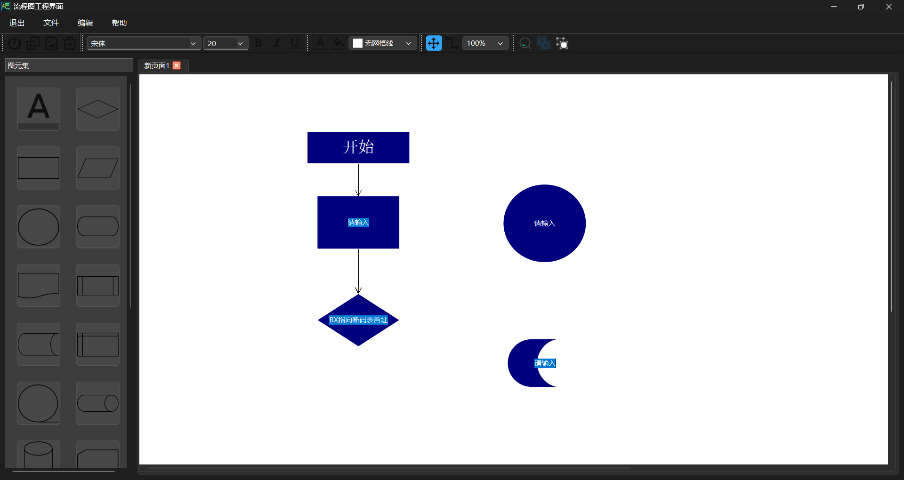
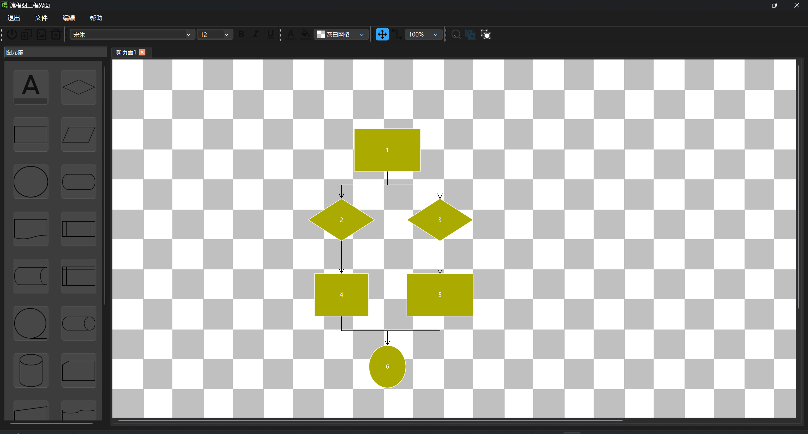

# DiagramScene 易用性测试问卷原始记录

> **测试软件**: DiagramScene  
> **测试时间**: 2025年12月  
> **测试对象**: 9名大学生  
> **问卷版本**: 16项指标  
> **测试说明**: 在win11上第一次直接运行exe文件时报错，因此我们将项目用qt 6.10自带的命令行工具windeployqt打包成exe文件，减小了qt的环境依赖性，方便转发给同学朋友进行测试，收到反馈得知此方法有效，没有朋友说打不开项目的问题。

---

## 问卷指标说明

### 评估维度（16项，5分制）
1. 工具栏布局清晰度
2. 操作直观性
3. 图形绘制简便性
4. 颜色/样式选择便利性
5. 保存/加载功能清晰度
6. 总体满意度
7. 最喜欢的功能
8. 最需要改进的地方
9. 其他建议
10. 易学性
11. 错误容忍度
12. 界面响应速度
13. 界面美观度
14. 任务完成效率
15. 连接线操作便利性
16. 文本编辑体验

---

### 【用户001】

| 基本信息 | 内容 |
|---------|------|
| **编号** | 001 |
| **使用时间** | 45 分钟 |
| **是否第一次使用** | 是 |

#### 评分详情

| 序号 | 评估项目 | 评分 | 详细反馈 |
|-----|---------|------|---------|
| 1 | 工具栏布局清晰度 | 2 | 左边那一排图标看不清楚是什么，而且挤在一起很乱。 |
| 2 | 操作直观性 | 2 | 我点了半天才知道原来要先点左边的图形再拖到画布上，不太会用。而且不知道为什么有时候没法编辑文字。 |
| 3 | 图形绘制简便性 | 3 | 图形倒是还可以，但是画完之后调整不了大小。 |
| 4 | 颜色/样式选择便利性 | 1 | **这个真的太难找了！**我找了10分钟才在菜单里找到改颜色的地方，而且颜色选项很少，想要别的颜色根本没法调。 |
| 5 | 保存/加载功能清晰度 | 3 | 保存文件能找到。 |
| 6 | 总体满意度 | 2 | 说实话挺难用的，我花了快一个小时才画出一个很简单的流程图，而且还不太满意。 |
| 7 | 最喜欢的功能 | — | 图形种类还挺多的，基本需要的形状都有。 |
| 8 | 最需要改进的地方 | — | **强烈建议把颜色选择做得方便一点！**还有最好能有个教程，告诉我们怎么用。界面看起来有点老。 |
| 9 | 其他建议 | — | 希望能直接保存成图片，现在保存的文件打不开，没法交作业。 |
| 10 | 易学性 | 1 | 很难上手，没有任何提示，全靠自己摸索。 |
| 11 | 错误容忍度 | 3 | 可以撤销操作，这个还不错。 |
| 12 | 界面响应速度 | 4 | 速度还可以，不卡。 |
| 13 | 界面美观度 | 1 | 界面看起来有点丑，感觉像很久以前的软件。 |
| 14 | 任务完成效率 | 1 | 效率很低，画一个简单的流程图用了快1小时。 |
| 15 | 连接线操作便利性 | 2 | 连线不太好连，经常连不准，而且连出来是直角的，看着不太舒服。 |
| 16 | 文本编辑体验 | 2 | 双击能输入文字，但是不知道怎么改字体大小和颜色，默认的字太小了。 |

**任务完成情况**: 画了一个3步的简单流程图，但效果不太理想。

---

### 【用户002】

| 基本信息 | 内容 |
|---------|------|
| **编号** | 002 |
| **使用时间** | 52 分钟 |
| **是否第一次使用** | 是 |

#### 评分详情

| 序号 | 评估项目 | 评分 | 详细反馈 |
|-----|---------|------|---------|
| 1 | 工具栏布局清晰度 | 2 | 图标太小太模糊，鼠标放上去也没有提示，不知道是干什么的。 |
| 2 | 操作直观性 | 2 | 操作不太友好，不符合平时用的那些软件的习惯。 |
| 3 | 图形绘制简便性 | 3 | 图形种类还可以，但是画完之后编辑不太方便。有时候数字输入不了。 |
| 4 | 颜色/样式选择便利性 | 1 | **这个真的完全不能接受！**背景颜色选择太简单了，只有几个固定颜色，不能自己调颜色，没有渐变效果。 |
| 5 | 保存/加载功能清晰度 | 3 | 能保存，但是不太方便。 |
| 6 | 总体满意度 | 1 | 真的不够用，我宁可用在线工具。 |
| 7 | 最喜欢的功能 | — | 图形库还算丰富，基本形状都有。 |
| 8 | 最需要改进的地方 | — | **必须把颜色系统做好！**要能自己调颜色、能调透明度。界面设计也需要重做，图标要清晰一点。 |
| 9 | 其他建议 | — | 建议学习一下那些专业工具的设计。现在这个看起来像很久以前的软件。 |
| 10 | 易学性 | 2 | 学习难度比较大，不太友好。 |
| 11 | 错误容忍度 | 3 | 有撤销，但是界面上没显示能撤销几步。 |
| 12 | 界面响应速度 | 4 | 性能还可以。 |
| 13 | 界面美观度 | 1 | 设计很一般，图标很模糊，字体太小。 |
| 14 | 任务完成效率 | 2 | 效率低，很多时间浪费在找功能上。 |
| 15 | 连接线操作便利性 | 2 | 连接线太简单了，只有直角的，箭头也不太好看。 |
| 16 | 文本编辑体验 | 2 | 文本编辑功能太弱，不能好好调整格式。 |

**任务完成情况**: 勉强画了一个流程图，但因为颜色和样式的限制，完全达不到要求。

---

### 【用户003】

| 基本信息 | 内容 |
|---------|------|
| **编号** | 003 |
| **使用时间** | 28 分钟 |
| **是否第一次使用** | 是 |

#### 评分详情

| 序号 | 评估项目 | 评分 | 详细反馈 |
|-----|---------|------|---------|
| 1 | 工具栏布局清晰度 | 3 | 图标有点小，看着有点模糊。 |
| 2 | 操作直观性 | 3 | 基本逻辑能理解，但是很多功能不知道在哪里，不如网页版的工具直观。 |
| 3 | 图形绘制简便性 | 2 | 绘图还可以。 |
| 4 | 颜色/样式选择便利性 | 2 | 这个是最大的问题。颜色选择在Edit菜单里，而且只有几个颜色，应该做一个完整的调色板。 |
| 5 | 保存/加载功能清晰度 | 3 | 保存加载功能正常。 |
| 6 | 总体满意度 | 3 | 作为课程作业还可以，但是离实用的软件还有不小差距，很多功能不够完善。 |
| 7 | 最喜欢的功能 | — | 图形种类比较全，对齐吸附功能也不错。 |
| 8 | 最需要改进的地方 | — | 颜色选择系统需要重做，界面设计需要优化，图标要更清晰。 |
| 9 | 其他建议 | — | 建议参考一些在线工具的设计，连接线可以做成曲线的。 |
| 10 | 易学性 | 3 | 对我来说还好，但是普通用户可能会觉得难。 |
| 11 | 错误容忍度 | 2 | 撤销重做功能有，但是有些操作撤销不了。 |
| 12 | 界面响应速度 | 4 | 性能还可以，不卡。 |
| 13 | 界面美观度 | 2 | 设计比较一般，图标很模糊，没有统一的风格。 |
| 14 | 任务完成效率 | 3 | 基本功能都有，但是因为界面的问题效率不算高。 |
| 15 | 连接线操作便利性 | 3 | 连接功能基本够用，但是只能是直角线，希望能增加曲线选项。 |
| 16 | 文本编辑体验 | 3 | 文本编辑基本可用，但是格式设置不太方便。 |

**任务完成情况**: 完成了测试任务，但体验一般。

---

### 【用户004】

| 基本信息 | 内容 |
|---------|------|
| **编号** | 004 |
| **使用时间** | 32 分钟 |
| **是否第一次使用** | 是 |

#### 评分详情

| 序号 | 评估项目 | 评分 | 详细反馈 |
|-----|---------|------|---------|
| 1 | 工具栏布局清晰度 | 3 | 布局还行，但是图标不够专业，而且没有鼠标悬停提示。 |
| 2 | 操作直观性 | 3 | 基本能理解操作逻辑，但是交互细节不够好。 |
| 3 | 图形绘制简便性 | 4 | 绘图功能还可以。 |
| 4 | 颜色/样式选择便利性 | 2 | 颜色选择太简单了，应该学习现代设计软件的颜色面板。 |
| 5 | 保存/加载功能清晰度 | 3 | 功能正常。 |
| 6 | 总体满意度 | 3 | 作为学生项目合格，但是和市面上的软件比差距比较大。 |
| 7 | 最喜欢的功能 | — | 对齐吸附功能做得不错。 |
| 8 | 最需要改进的地方 | — | 界面设计需要大幅改进，增加导出功能，优化颜色选择。 |
| 9 | 其他建议 | — | 建议做一下用户调研，参考一下同类产品。 |
| 10 | 易学性 | 3 | 需要一定时间适应，缺少新手引导。 |
| 11 | 错误容忍度 | 3 | 撤销功能有但不够完善。 |
| 12 | 界面响应速度 | 3 | 性能还可以。 |
| 13 | 界面美观度 | 2 | 设计不够专业。 |
| 14 | 任务完成效率 | 3 | 基本功能能完成，但效率不算高。 |
| 15 | 连接线操作便利性 | 3 | 连接线功能基本够用，但样式单一。 |
| 16 | 文本编辑体验 | 3 | 文本编辑功能比较基础。 |

**任务完成情况**: 完成了测试。

---

### 【用户005】
| 基本信息 | 内容 |
|---------|------|
| **测试员编号** | 005 |
| **使用时间** | 29 分钟 |
| **是否第一次使用** | 是 |

#### 评分详情

| 序号 | 评估项目 | 评分 | 详细反馈 |
|-----|---------|------|---------|
| 1 | 工具栏布局清晰度 | 3 | 布局还可以，但图标不够清晰。 |
| 2 | 操作直观性 | 2 | 基本能理解。 |
| 3 | 图形绘制简便性 | 4 | 绘图方便。 |
| 4 | 颜色/样式选择便利性 | 2 | 颜色选择很差。 |
| 5 | 保存/加载功能清晰度 | 4 | 正常。 |
| 6 | 总体满意度 | 2 | 基本够用，但不够完善。 |
| 7 | 最喜欢的功能 | — | 能画数据流程图和ETL流程。 |
| 8 | 最需要改进的地方 | — | 增加数据流图符号（数据库、API、数据流等）。改进UI。 |
| 9 | 其他建议 | — | 支持从代码生成流程图（Python脚本）。 |
| 10 | 易学性 | 2 | 需要适应。 |
| 11 | 错误容忍度 | 3 | 正常。 |
| 12 | 界面响应速度 | 4 | 快。 |
| 13 | 界面美观度 | 2 | 不够现代。 |
| 14 | 任务完成效率 | 2 | 一般。 |
| 15 | 连接线操作便利性 | 3 | 够用。 |
| 16 | 文本编辑体验 | 2 | 正常。 |

---

### 【用户006】

| 基本信息 | 内容 |
|---------|------|
| **编号** | 006 |
| **使用时间** | 32 分钟 |
| **是否第一次使用** | 是 |

#### 评分详情

| 序号 | 评估项目 | 评分 | 详细反馈 |
|-----|---------|------|---------|
| 1 | 工具栏布局清晰度 | 3 | 布局还行，但是图标不够清晰，而且没有鼠标悬停提示。 |
| 2 | 操作直观性 | 3 | 基本能理解操作逻辑，但是交互细节不够好。 |
| 3 | 图形绘制简便性 | 2 | 绘图功能还可以。 |
| 4 | 颜色/样式选择便利性 | 2 | 颜色选择太简单了，应该有个完整的调色板。 |
| 5 | 保存/加载功能清晰度 | 3 | 功能正常。 |
| 6 | 总体满意度 | 2 | 作为学生项目合格，但是和市面上的软件比差距比较大。 |
| 7 | 最喜欢的功能 | — | 对齐吸附功能做得不错。 |
| 8 | 最需要改进的地方 | — | 界面设计需要改进，增加导出功能，优化颜色选择。 |
| 9 | 其他建议 | — | 建议做一下用户调研，参考一下同类产品。 |
| 10 | 易学性 | 3 | 需要一定时间适应，缺少新手引导。 |
| 11 | 错误容忍度 | 4 | 撤销功能有但不够完善。 |
| 12 | 界面响应速度 | 4 | 性能还可以。 |
| 13 | 界面美观度 | 1 | 设计不够专业。 |
| 14 | 任务完成效率 | 3 | 基本功能能完成，但效率不算高。 |
| 15 | 连接线操作便利性 | 3 | 连接线功能基本够用，但样式单一。 |
| 16 | 文本编辑体验 | 3 | 文本编辑功能比较基础。 |

**任务完成情况**: 完成了测试任务。

---

### 【用户007】

| 基本信息 | 内容 |
|---------|------|
| **编号** | 007 |
| **使用时间** | 35 分钟 |
| **是否第一次使用** | 是 |

#### 评分详情

| 序号 | 评估项目 | 评分 | 详细反馈 |
|-----|---------|------|---------|
| 1 | 工具栏布局清晰度 | 2 | 布局还行，但图标不够清楚。 |
| 2 | 操作直观性 | 3 | 基本能理解。 |
| 3 | 图形绘制简便性 | 4 | 绘图方便。 |
| 4 | 颜色/样式选择便利性 | 1 | 颜色选择太简陋。 |
| 5 | 保存/加载功能清晰度 | 2 | 还可以。 |
| 6 | 总体满意度 | 3 | 基本满足需求，但不够完善。 |
| 7 | 最喜欢的功能 | — | 能画出需要的图形。 |
| 8 | 最需要改进的地方 | — | 改进UI，增加导出功能。 |
| 9 | 其他建议 | — | 希望能有更多图形样式。 |
| 10 | 易学性 | 3 | 需要适应一下。 |
| 11 | 错误容忍度 | 2 | 有撤销功能。 |
| 12 | 界面响应速度 | 3 | 可以。 |
| 13 | 界面美观度 | 2 | 界面一般。 |
| 14 | 任务完成效率 | 3 | 效率一般。 |
| 15 | 连接线操作便利性 | 3 | 够用。 |
| 16 | 文本编辑体验 | 3 | 正常。 |

**任务完成情况**: 完成了测试任务。

---

### 【用户008】

| 基本信息 | 内容 |
|---------|------|
| **编号** | 008 |
| **使用时间** | 33 分钟 |
| **是否第一次使用** | 是 |

#### 评分详情

| 序号 | 评估项目 | 评分 | 详细反馈 |
|-----|---------|------|---------|
| 1 | 工具栏布局清晰度 | 2 | 图标不够专业。 |
| 2 | 操作直观性 | 2 | 基本能理解。 |
| 3 | 图形绘制简便性 | 3 | 绘图还可以，但精确度不够。 |
| 4 | 颜色/样式选择便利性 | 1 | 颜色选择不方便。 |
| 5 | 保存/加载功能清晰度 | 3 | 正常。 |
| 6 | 总体满意度 | 3 | 能用但不够专业。 |
| 7 | 最喜欢的功能 | — | 图形可以调整大小。 |
| 8 | 最需要改进的地方 | — | 希望能更精确地定位图形。 |
| 9 | 其他建议 | — | 增加一些辅助线和网格。 |
| 10 | 易学性 | 2 | 需要适应。 |
| 11 | 错误容忍度 | 3 | 撤销正常。 |
| 12 | 界面响应速度 | 3 | 流畅。 |
| 13 | 界面美观度 | 2 | 不够专业。 |
| 14 | 任务完成效率 | 3 | 一般。 |
| 15 | 连接线操作便利性 | 2 | 基本够用。 |
| 16 | 文本编辑体验 | 3 | 正常。 |

**任务完成情况**: 完成了测试任务。

---

### 【用户009】

| 基本信息 | 内容 |
|---------|------|
| **编号** | 009 |
| **使用时间** | 37 分钟 |
| **是否第一次使用** | 是 |

#### 评分详情

| 序号 | 评估项目 | 评分 | 详细反馈 |
|-----|---------|------|---------|
| 1 | 工具栏布局清晰度 | 3 | 布局还行。 |
| 2 | 操作直观性 | 3 | 基本能理解。 |
| 3 | 图形绘制简便性 | 3 | 绘图还可以。 |
| 4 | 颜色/样式选择便利性 | 2 | 颜色很差。 |
| 5 | 保存/加载功能清晰度 | 3 | 正常。 |
| 6 | 总体满意度 | 3 | 基本能用。 |
| 7 | 最喜欢的功能 | — | 能画出需要的流程图。 |
| 8 | 最需要改进的地方 | — | 改进颜色和UI。 |
| 9 | 其他建议 | — | 支持多种导出格式。 |
| 10 | 易学性 | 3 | 需要适应。 |
| 11 | 错误容忍度 | 3 | 正常。 |
| 12 | 界面响应速度 | 4 | 快。 |
| 13 | 界面美观度 | 2 | 一般。 |
| 14 | 任务完成效率 | 3 | 一般。 |
| 15 | 连接线操作便利性 | 3 | 够用。 |
| 16 | 文本编辑体验 | 3 | 正常。 |

**任务完成情况**: 完成了测试任务。

---

## 用户反馈图

---

## 附录：数据汇总表

| 编号 | Q1 | Q2 | Q3 | Q4 | Q5 | Q6 | Q10 | Q11 | Q12 | Q13 | Q14 | Q15 | Q16 |
|------|----|----|----|----|----|----|-----|-----|-----|-----|-----|-----|-----|
| 001 | 2 | 2 | 3 | 1 | 3 | 2 | 1 | 3 | 4 | 1 | 1 | 2 | 2 |
| 002 | 2 | 2 | 3 | 1 | 3 | 1 | 2 | 3 | 4 | 1 | 2 | 2 | 2 |
| 003 | 3 | 3 | 2 | 2 | 3 | 3 | 3 | 2 | 4 | 2 | 3 | 3 | 3 |
| 004 | 3 | 3 | 4 | 2 | 3 | 3 | 3 | 3 | 3 | 2 | 3 | 3 | 3 |
| 005 | 3 | 2 | 4 | 2 | 4 | 2 | 2 | 3 | 4 | 2 | 2 | 3 | 2 |
| 006 | 3 | 3 | 2 | 2 | 3 | 2 | 3 | 4 | 4 | 1 | 3 | 3 | 3 |
| 007 | 2 | 3 | 4 | 1 | 2 | 3 | 3 | 2 | 3 | 2 | 3 | 3 | 3 |
| 008 | 2 | 2 | 3 | 1 | 3 | 3 | 2 | 3 | 3 | 2 | 3 | 2 | 3 |
| 009 | 3 | 3 | 3 | 2 | 3 | 3 | 3 | 3 | 4 | 2 | 3 | 3 | 3 |

### 使用时间统计

| 编号 | 使用时间（分钟） | 任务完成情况 |
|------|----------------|-------------|
| 001 | 45 | 完成 |
| 002 | 52 | 完成 |
| 003 | 28 | 完成 |
| 004 | 32 | 完成 |
| 005 | 29 | 完成 |
| 006 | 32 | 完成 |
| 007 | 35 | 完成 |
| 008 | 33 | 完成 |
| 009 | 37 | 完成 |

---

**数据采集时间**: 2025年12月  

---

