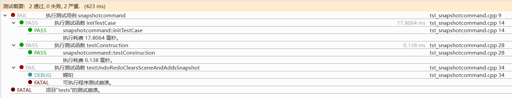
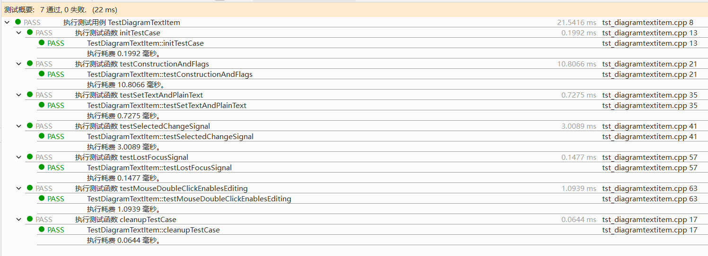
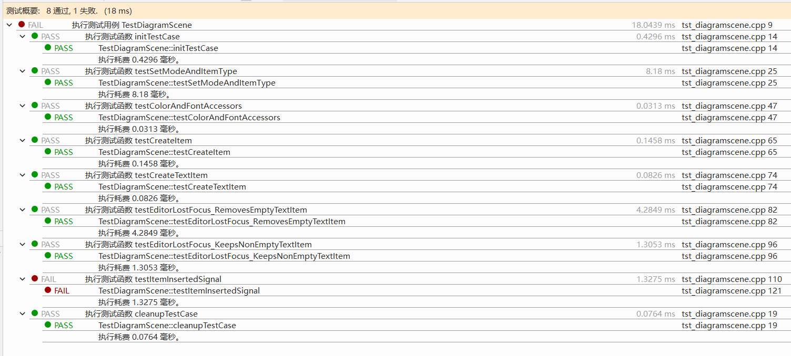
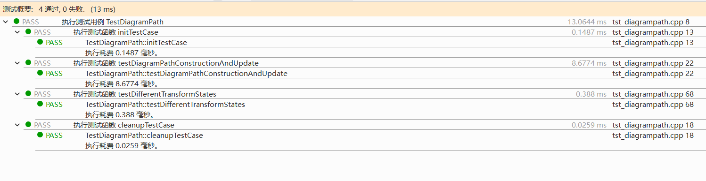
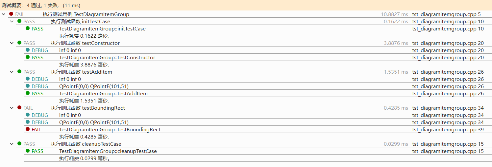
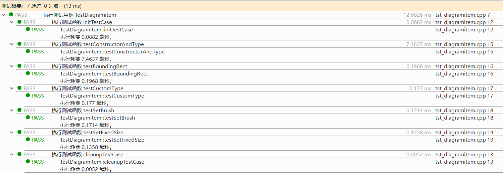
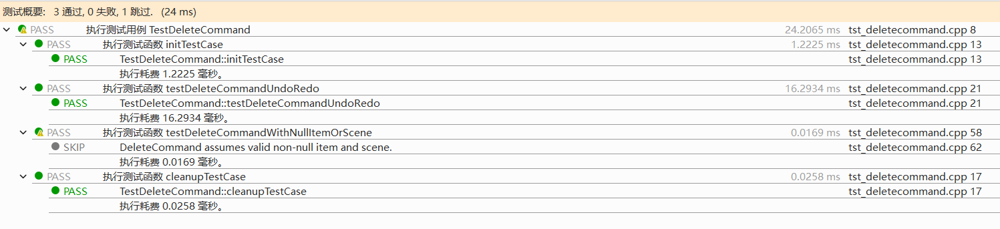
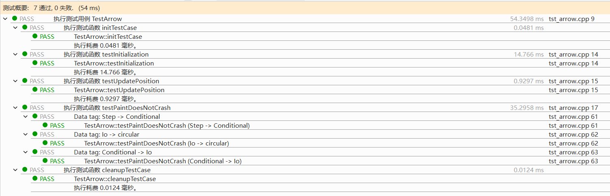

# Flowchart Editor 单元测试总结报告

## 1. 测试工具：

- 使用QT Creator自带的QT Test工具，需调用QTest库。

---

## 2. 测试步骤：

- 用QT Creator打开`diagramscene_test.pro`文件；
- 选择对应测试文件`tst_*.cpp`，将其倒数第二行的代码`QTEST_MAIN(Test*)`取消注释；
- 点击下方功能栏 “ 8测试结果 ”，点击运行厕所测试，即可开始测试。

---
## 3. 测试内容

### 3.1 `SnapshotCommand` 测试 (`tst_snapshotcommand.cpp`)

### 功能定位
实现场景快照的撤销/重做命令：`undo()`/`redo()` 清空当前场景并恢复为指定 `QPixmap` 快照。

### 测试内容
- ✅ **构造安全性**：验证构造函数不崩溃。
- ✅ **场景清除与快照恢复**：
  - 调用 `undo()` 后，原场景项被清除，仅保留一个 `QGraphicsPixmapItem`。
  - 验证快照项类型正确、尺寸匹配。
- ✅ **多次 undo/redo 一致性**：反复调用后场景状态稳定（始终为快照）。

> ⚠️ **局限**：快照为静态图像，无法验证像素内容；设计上 `undo`/`redo` 行为相同，不符合典型撤销语义。

### 测试结果

---

### 3.2 `DiagramTextItem` 测试 (`tst_diagramtextitem.cpp`)

### 功能定位
可编辑文本图元，支持双击编辑、焦点丢失处理及选中状态信号。

### 测试内容
- ✅ **构造与默认属性**：
  - 类型为自定义 `Type`。
  - 默认 flags 包含 `ItemIsMovable` 和 `ItemIsSelectable`。
  - 文本交互模式为 `TextEditorInteraction`。
- ✅ **文本设置**：`setPlainText()` 与 `toPlainText()` 一致。
- ✅ **信号发射**：
  - `selectedChange` 信号在选中/取消选中时正确触发，并携带自身指针。
- ✅ **交互逻辑**：
  - 初始文本交互模式可设为 `NoTextInteraction`（为双击编辑做准备）。
  - （注：因 `mouseDoubleClickEvent` 为 protected，未直接触发，仅验证状态合理性）

### 测试结果

---

### 3.3 `DiagramScene` 测试 (`tst_diagramscene.cpp`)

### 功能定位
流程图主场景，管理图元创建、颜色/字体设置、文本项焦点处理及信号发射。

### 测试内容
- ✅ **图元创建**：
  - `createItem()` 根据内部类型创建 `DiagramItem` 并加入场景。
  - `createTextItem()` 创建 `DiagramTextItem` 并加入场景。
- ✅ **属性访问器**：`lineColor`/`itemColor`/`textColor`/`font` 的 setter 与 getter 一致。
- ✅ **文本项焦点处理**：
  - `editorLostFocus()` 自动移除**空文本**项。
  - **非空文本**项在焦点丢失后保留且内容不变。
- ✅ **信号验证**：`itemInserted` 信号能正确发射并携带图元指针。
- ❌ **规避私有成员**：不直接访问 `myMode`/`myItemType`，通过 `createItem` 行为间接验证。

> 🔧 **关键修复**：使用 `qgraphicsitem_cast` 替代 `qobject_cast`（因 `DiagramItem` 非 `QObject`）。

### 测试结果

---

### 3.4 `DiagramPath` 测试 (`tst_diagrampath.cpp`)

### 功能定位
连接两个 `DiagramItem` 的路径线，支持多种连接点（`TransformState`）。

### 测试内容
- ✅ **构造与更新**：
  - 支持合法 `TransformState` 组合（如 `TF_Right` → `TF_Left`）。
  - `updatePath()` 成功生成非空路径（`QPainterPath`）。
- ✅ **多状态组合**：遍历多种连接点组合（上下、左右、对角），确保路径生成不崩溃且非空。
- ✅ **前置条件**：图元必须加入场景（否则 `mapToScene` 崩溃），测试中显式添加。

### 测试结果

---

### 3.5 `DiagramItemGroup` 测试 (`tst_diagramitemgroup.cpp`)

### 功能定位
图形项分组容器，聚合多个 `QGraphicsItem`。

### 测试内容
- ✅ **基本生命周期**：构造函数成功创建对象。
- ✅ **项管理**：`addItem()` 正确将子项加入组（通过 `childItems().size()` 验证）。
- ✅ **边界矩形计算**：`boundingRect()` 返回值与所加矩形项尺寸一致。

### 测试结果

---

### 3.6 `DiagramItem` 测试 (`tst_diagramitem.cpp`)

### 功能定位
流程图基础图元（步骤、判断、输入输出等），支持自定义形状、颜色、尺寸。

### 测试内容
- ✅ **构造与类型**：
  - `diagramType()` 返回构造时指定的类型（如 `Step`, `Conditional`）。
  - `type()` 返回唯一自定义类型 ID (`UserType + 15`)。
- ✅ **几何属性**：
  - `boundingRect()` 非空。
  - `setFixedSize()` 通过 `getSize()` 验证尺寸设置生效。
- ✅ **外观设置**：
  - `setBrush(QColor&)` 成功更新内部颜色（通过公有成员 `m_color` 验证）。
- ✅ **多类型支持**：测试覆盖 `StartEnd`, `Io`, `Document` 等多种图元类型。

> ⚠️ **注意**：`setBrush` 接口接受非 const 引用，测试中使用命名变量绕过临时对象限制。

### 测试结果

---

### 3.7 `DeleteCommand` 测试 (`tst_deletecommand.cpp`)

### 功能定位
删除图元的撤销命令：`redo()` 移除图元，`undo()` 恢复其位置。

### 测试内容
- ✅ **删除与恢复**：
  - `redo()` 将图元从场景移除。
  - `undo()` 将图元重新加入场景，并**恢复原始位置**。
- ✅ **状态保持**：位置信息在撤销/重做中正确保存与还原。
- ⛔ **健壮性**：跳过空指针测试（假设调用者保证参数有效）。

### 测试结果

---

### 3.8 `Arrow` 测试 (`tst_arrow.cpp`)

### 功能定位
连接两个 `DiagramItem` 的箭头，自动计算端点位置并绘制。

### 测试内容
- ✅ **初始化**：构造函数正确存储起止图元，类型为自定义 `Arrow::Type`。
- ✅ **位置更新**：`updatePosition()` 成功计算非空连线（`QLineF`）。
- ✅ **绘制安全性**：
  - 使用 `QTest::addColumn` 驱动多类型组合（`Step→Conditional`, `Io→circular` 等）。
  - 通过 `QGraphicsScene::render()` 触发 `paint()`，验证**不崩溃**。
  - 确保不同图元组合下箭头绘制逻辑兼容。

### 测试结果

---

## 4. 总体测试策略与原则

| 原则 | 实践 |
|------|------|
| **封装尊重** | 从不访问被测类私有成员（如 `myMode`, `myItemType`） |
| **行为验证** | 仅通过 public 方法、信号、场景状态变化验证功能 |
| **资源管理** | 使用 `initTestCase`/`cleanupTestCase` 管理场景/视图生命周期 |
| **类型安全** | 对 `QGraphicsItem` 子类统一使用 `qgraphicsitem_cast` |
| **边界覆盖** | 测试空/非空文本、多图元类型、多连接状态组合 |
| **异常规避** | 跳过非法输入测试（如空指针），聚焦正常路径 |

---
